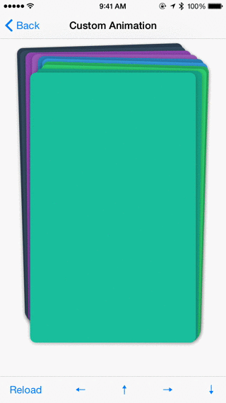
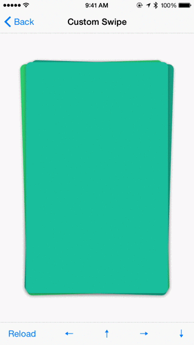
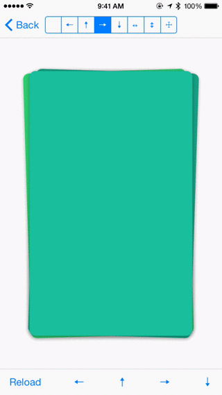
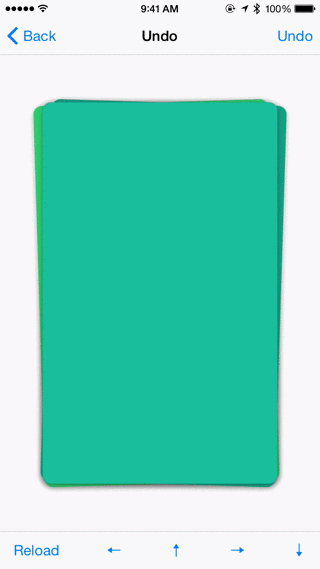
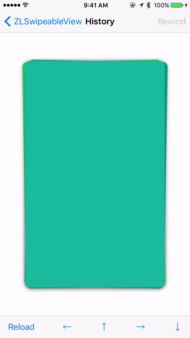

# ZLSwipeableViewSwift
A simple view for building card like interface like [Tinder](http://www.gotinder.com/) and [Potluck](https://www.potluck.it/). ZLSwipeableViewSwift is based on [ZLSwipeableView](https://github.com/zhxnlai/ZLSwipeableView/).

Preview
---
### Custom Animation

### Custom Swipe

### Custom Direction

### Undo

### Rewind

CocoaPods
---
You can install `ZLSwipeableViewSwift` through CocoaPods adding the following to your Podfile:

    pod 'ZLSwipeableViewSwift'
    use_frameworks!
Then import it using:

    import ZLSwipeableViewSwift

Usage
---
Check out the [demo app](https://github.com/zhxnlai/ZLSwipeableViewSwift/archive/master.zip) for an example. It contains the following demos: Default, Custom Animation, Custom Swipe, Allowed Direction, History, Previous View, Should Swipe and Always Swipe.

### Instantiation
`ZLSwipeableView` can be added to storyboard or instantiated programmatically:
~~~swift
var swipeableView = ZLSwipeableView(frame: CGRect(x: 0, y: 0, width: 300, height: 500)))
view.addSubview(swipeableView)
~~~

### Adding Views
`ZLSwipeableView` supports both adding views to the front and to the back.
~~~swift
public var numberOfActiveView = UInt(4)
public var nextView: (() -> UIView?)?
public var previousView: (() -> UIView?)?
~~~
#### Adding views to the back
`nextView`, a closure that returns an `UIView`, works with `loadViews` and `numberOfActiveView`. It acts as the data source. After defining it, `ZLSwipeableView` will call `loadViews` which will invoke `nextView` `numberOfActiveView` times and insert them in the back. `loadViews` will also be called each time a view is swiped.

~~~swift
public func loadViews()
// Usage:
swipeableView.numPrefetchedViews = 3
swipeableView.nextView = {
  return UIView()
}
swipeableView.loadViews() // optional, automatically call after nextView is set
~~~

#### Adding views to the front
`previousView` works with `rewind`, which inserts a view in the front and positions it at the center with animation.
Note that `rewind` calls `previousView` only when `history` is empty, otherwise it returns the most recently swiped view. Please try out the [Previous View](#rewind) example for more information.
~~~swift
public func rewind()
// Usage:
swipeableView.previousView = {
  return UIView()
}
swipeableView.rewind()
~~~

#### Interface Builder
If you need to work with Interface Builder, the demo app includes examples of both creating views programmatically and loading views from Xib files that [use Auto Layout](https://github.com/zhxnlai/ZLSwipeableView/issues/9).

### Removing Views

#### Swiping programmatically
The user can swipe views in the allowed directions. This can also happen programmatically.

You can swipe the top view programmatically in one of the predefined directions or with point and direction in the view's coordinate.
~~~swift
public func swipeTopView(inDirection direction: Direction)
// Usage:
swipeableView.swipeTopView(inDirection: .Left)
swipeableView.swipeTopView(inDirection: .Up)
swipeableView.swipeTopView(inDirection: .Right)
swipeableView.swipeTopView(inDirection: .Down)

public func swipeTopView(fromPoint location: CGPoint, inDirection directionVector: CGVector)
// Usage:
swipeableView.swipeTopView(fromPoint: CGPoint(x: 100, y: 30), inDirection: CGVector(dx: 100, dy: -800))
~~~

#### Rewinding
`ZLSwipeableView` keeps a history of swiped views. They can be retrieved by calling `rewind`.
~~~swift
public var history = [UIView]()
public var numberOfHistoryItem = UInt(10)

public func rewind()
~~~

#### Removing all views
To discard all views and reload programmatically (discarded views cannot by rewinded):
~~~swift
swipeableView.discardViews()
swipeableView.loadViews()
~~~

### Delegate
Here is a list of callbacks you can listen to:
~~~swift
swipeableView.didStart = {view, location in
    print("Did start swiping view at location: \(location)")
}
swipeableView.swiping = {view, location, translation in
    print("Swiping at view location: \(location) translation: \(translation)")
}
swipeableView.didEnd = {view, location in
    print("Did end swiping view at location: \(location)")
}
swipeableView.didSwipe = {view, direction, vector in
    print("Did swipe view in direction: \(direction), vector: \(vector)")
}
swipeableView.didCancel = {view in
    print("Did cancel swiping view")
}
~~~

### Customization
Here is a list of customizable behaviors:
~~~swift
public var animateView = ZLSwipeableView.defaultAnimateViewHandler()
public var interpretDirection = ZLSwipeableView.defaultInterpretDirectionHandler()
public var shouldSwipeView = ZLSwipeableView.defaultShouldSwipeViewHandler()
public var minTranslationInPercent = CGFloat(0.25)
public var minVelocityInPointPerSecond = CGFloat(750)
public var allowedDirection = Direction.Horizontal
~~~

#### interpretDirection
You can change how the direction gets interpreted by overriding the `interpretDirection` property. Take a look at the [Custom Swipe](#custom-swipe) example for details.

#### animateView
You can create custom animation by overriding the `animateView` property. Take a look at the [Custom Animation](#custom-animation) example for details.

#### Should Swipe
`shouldSwipeView`, `minTranslationInPercent` and `minVelocityInPointPerSecond` determines whether a view should be swiped or not. Please see Should Swipe example for details.

#### allowedDirection
The `allowedDirection` property limits the directions in which the user is allowed to swipe. Please see the [Custom Direction](#custom-direction) example for details.
~~~swift
swipeableView.allowedDirection = .Left | .Up
swipeableView.allowedDirection = .All
~~~

### Misc

~~~swift
public func topView() -> UIView?

public func activeViews() -> [UIView]
~~~

Requirements
---
- iOS 7 or higher.

Credits
---
Big thanks to the [contributors](https://github.com/zhxnlai/ZLSwipeableView/graphs/contributors) of ZLSwipeableView.

License
---
ZLSwipeableViewSwift is available under MIT license. See the LICENSE file for more info.
